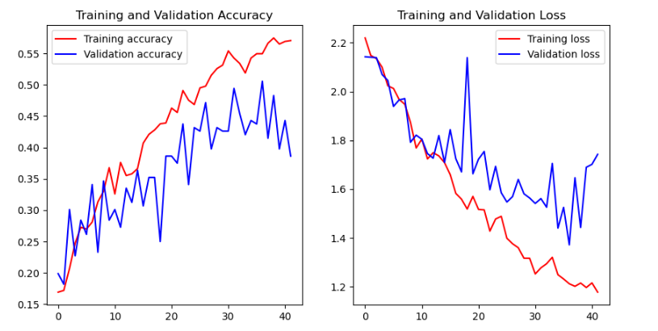

# Advanced Machine Learning Techniques for Waste Classification and Employee Ratings Prediction



This repository contains the code for training and evaluating a Convolutional Neural Network (CNN) to classify waste images from the RealWaste dataset. The RealWaste dataset can be downloaded from [UCI Machine Learning Repository](https://archive.ics.uci.edu/dataset/908/realwaste).

## Project Overview

The project is divided into two parts, each documented in the provided Jupyter notebooks and PDFs:

- **Part 1:** Detailed in `ML2_Part1_Machine-Learning-for-Business-Intelligence-2--Spring,-2024-.pdf` and its corresponding R Markdown file.
- **Part 2:** Detailed in `ML2_Part2_Machine Learning for Business Intelligence.pdf` and its corresponding Jupyter notebook `ML2_Part2_Machine Learning for Business Intelligence.ipynb`.

## Dataset

To use this repository, you need to download the RealWaste dataset and place it in the root folder of the project. The dataset should be organized as follows:

```
root/
│
├── RealWaste/
│ ├── Cardboard/
│ ├── Food Organics/
│ ├── Glass/
│ ├── Metal/
│ ├── Miscellaneous Trash/
│ ├── Paper/
│ ├── Plastic/
│ ├── Textile Trash/
│ └── Vegetation/
│
├── RealWaste_Sampled/
│ ├── Cardboard/
│ ├── Food Organics/
│ ├── Glass/
│ ├── Metal/
│ ├── Miscellaneous Trash/
│ ├── Paper/
│ ├── Plastic/
│ ├── Textile Trash/
│ └── Vegetation/
│
├── Data.xls
├── ML2_Part1_Machine-Learning-for-Business-Intelligence-2--Spring,-2024-.pdf
├── ML2_Part1_Machine-Learning-for-Business-Intelligence-2--Spring,-2024-.Rmd
├── ML2_Part2_Machine Learning for Business Intelligence.pdf
├── ML2_Part2_Machine Learning for Business Intelligence.ipynb
├── requirements.txt
└── README.md
```

## Instructions

1. **Download and Prepare the Dataset**
   - Download the RealWaste dataset from [UCI Machine Learning Repository](https://archive.ics.uci.edu/dataset/908/realwaste).
   - Extract the dataset and place the `RealWaste` folder in the root directory of this repository.

2. **Install Required Libraries**
   - Install the necessary Python libraries by running:
     ```sh
     pip install -r requirements.txt
     ```

3. **Run the Jupyter Notebooks**
   - Open and run all cells in `ML2_Part2_Machine Learning for Business Intelligence.ipynb`. This notebook includes all steps from loading the dataset to evaluating the trained model.

4. **Run the R Markdown File**
   - Open and run the R Markdown file `ML2_Part1_Machine-Learning-for-Business-Intelligence-2--Spring,-2024-.Rmd` to execute Part 1 of the project.

## Results

The trained model achieves a validation accuracy of approximately 52.54%. Detailed results and model evaluation metrics are provided in the respective notebooks and PDF documents.

## Contributing

Feel free to open issues or submit pull requests if you have any suggestions or improvements.
